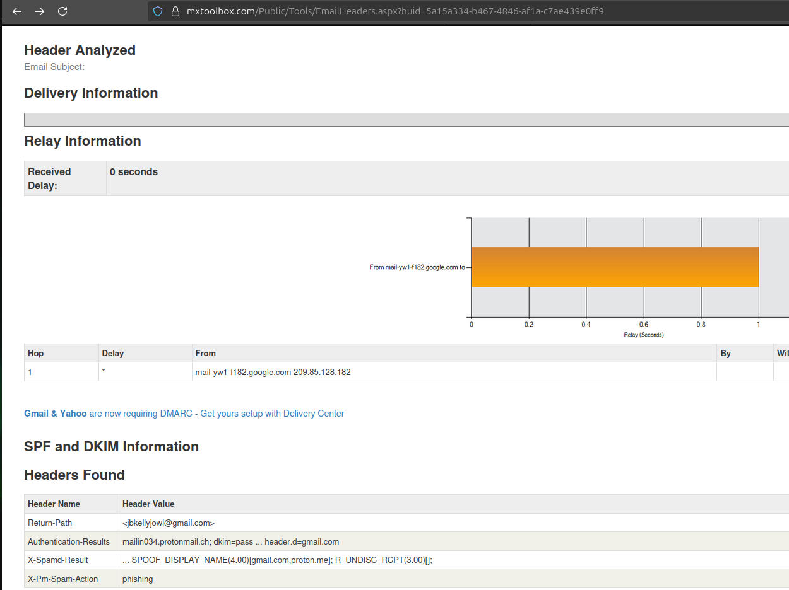
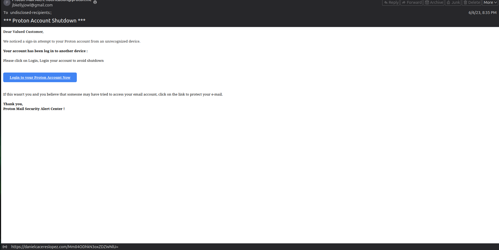
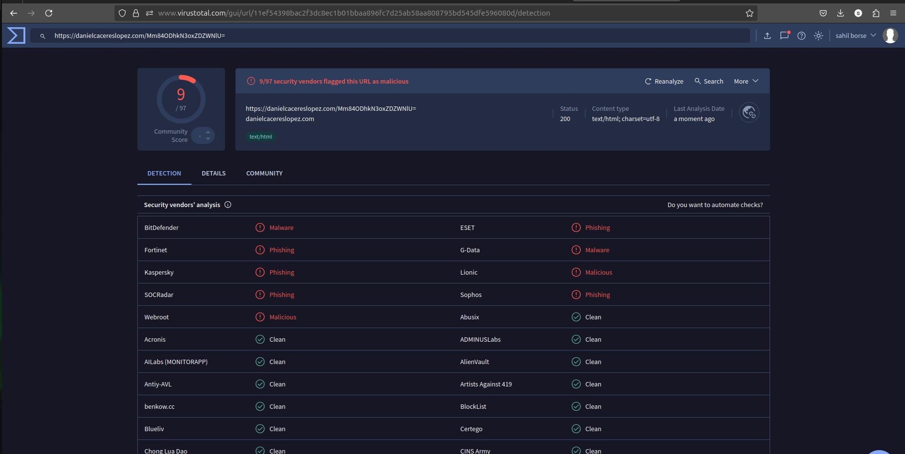

# 📧 Phishing Email Analysis Report – Elevate Labs Task 2

## 🗂️ Task Overview

- **Objective:** Identify phishing characteristics in a sample email for **Day 2** of the **Elevate Labs Cybersecurity Internship** (*June 24, 2025*).
- **Sample Analyzed:** `sample-1187.eml`
- **Tools Used:**
  - `nano`: View and inspect the `.eml` file
  - [MxToolbox Email Header Analyzer](https://mxtoolbox.com/EmailHeaders.aspx)
  - [VirusTotal](https://virustotal.com) for URL reputation check
  - [PhishTool](https://www.phishtool.com/) for email analysis

---

## 🚩 Phishing Indicators Found

### 1. 🔐 Spoofed Sender Email Address

- **Finding:**  
  Display name: `Proton Mail Alert notification@proton.me`  
  Actual email: `<jbkellyjowl@gmail.com>`
- **Analysis:**  
  The mismatch indicates **email spoofing** to impersonate Proton Mail.

---

### 2. 📨 Email Header Discrepancies

- **SPF:** ✅ Pass (IP belongs to Gmail, not Proton)
- **DKIM:** ✅ Pass (signed by Gmail, not Proton)
- **DMARC:** ✅ Pass with `p=none` → No enforcement
- **Other Flags:**
  - `SPOOF_DISPLAY_NAME(4.00)`: Display name spoofing
  - `To: undisclosed-recipients:`: Indicates mass phishing
  - `X-Spam: Yes` and `X-Pm-Spam-Action: phishing`: Marked malicious

- **📸 Screenshot:**  
  
  
  
---

### 3. 🔗 Suspicious Link

- **URL in Email Body:**
  ```html
  https://danielcacereslopez.com/Mm84ODhkN3oxZDZWNlU=

